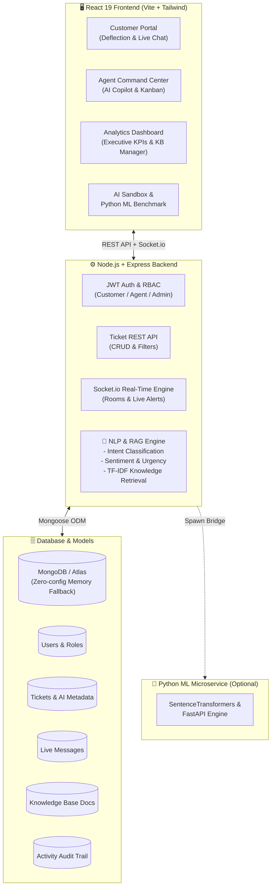

<div align="center">

# 🤖 ResolvAI: Enterprise AI Customer Ticket Resolution System
### *Autonomous Multi-Tier Triage, RAG Knowledge Synthesis & Agent Copilot*
#### **Full-Stack MERN Major Project**

[](https://www.mongodb.com/)
[](https://expressjs.com/)
[](https://reactjs.org/)
[](https://nodejs.org/)
[](https://socket.io/)
[](https://tailwindcss.com/)

---

</div>

## 📖 Executive Summary & Motivation

Traditional customer support platforms suffer from slow resolution times, high operational overhead, and ticket backlogs. **ResolvAI** elevates customer support into an autonomous, intelligent system built on the **MERN (MongoDB, Express, React, Node.js) Stack** coupled with an advanced **NLP Triage & Retrieval-Augmented Generation (RAG) Engine**.

Unlike simple chatbots, ResolvAI provides an end-to-end enterprise solution:
1. **Real-time Ticket Deflection & Pre-Triage**: As a customer types their issue, the AI classifies intent, estimates confidence, and suggests immediate verified solutions.
2. **Multi-Tier Automated Routing**:
   - **Tier 1 (Auto-Resolvable)**: Routine queries (password resets, 2FA, simple FAQs) resolved in `< 2 seconds` with zero human intervention.
   - **Tier 2 (Agent Assisted)**: AI generates draft replies and links knowledge articles for support agents to review with 1 click.
   - **Tier 3 (Emergency Escalation)**: High-urgency outages or security vulnerabilities trigger instant notifications and senior assignment.
3. **Agent AI Copilot**: Empowers staff agents with tone rewriting (*Empathetic, Concise, Formal*), thread summarization, and RAG search.
4. **Live Bi-Directional WebSockets**: Instant updates on ticket status, message delivery, and typing indicators via Socket.io.
5. **Executive Analytics & CSAT**: Real-time KPI dashboards tracking deflection rates, latency, and verified customer satisfaction.

---

## 🏛️ System Architecture



---

## 📁 Clean & Organized Architecture

```
AI-Customer-Ticket-Resolution-Bot/
├── client/                               # React 19 Frontend (Clean Light Theme)
│   ├── src/
│   │   ├── components/
│   │   │   ├── common/                   # Shared Badges & Indicators (TicketBadge.jsx)
│   │   │   ├── layout/                   # Navbar.jsx, Sidebar.jsx
│   │   │   └── modals/                   # NewTicketModal.jsx, TicketDetailModal.jsx
│   │   ├── views/                        # Page Views
│   │   │   ├── TicketWorkspaceView.jsx   # Kanban & Tabular Ticket Center
│   │   │   ├── AnalyticsView.jsx         # Executive KPI Dashboard
│   │   │   ├── KnowledgeBaseView.jsx     # Semantic RAG Documentation
│   │   │   └── AiPlaygroundView.jsx      # AI Test Bench & ML Comparison
│   │   ├── context/                      # AuthContext.jsx (Role Switcher & Socket.io)
│   │   ├── services/                     # api.js (Axios Client)
│   │   ├── App.jsx                       # Master Dashboard Shell
│   │   └── index.css                     # Crisp Lite Design System
│   └── vite.config.js                    # Vite Configuration (Port 3000 + Proxy)
│
├── server/                               # Node.js + Express + Socket.io Backend
│   ├── src/
│   │   ├── config/                       # db.js (MongoDB + Memory Fallback), constants.js
│   │   ├── controllers/                  # analytics, auth, kb, message, ticket
│   │   ├── middleware/                   # authMiddleware.js, errorMiddleware.js
│   │   ├── models/                       # ActivityLog, KnowledgeBase, Message, Ticket, User
│   │   ├── routes/                       # index.js (Master API Router), auth, ticket, kb, analytics
│   │   ├── seeds/                        # seed.js (Demo Users & Knowledge Base)
│   │   ├── services/                     # aiEngine.js, socketService.js
│   │   └── server.js                     # Server Entry Point
│   └── package.json
│
├── package.json                          # Unified Root Runner
├── run-all.js                            # Concurrently boots frontend & backend
└── README.md
```

---

## 🎯 Major Project Features Breakdown

### 1. 🌐 Customer Portal & AI Deflection
- **Real-Time As-You-Type AI Pre-Triage**: Analyzes category, confidence score, and urgency before submission.
- **Interactive Ticket Chatroom**: Live conversation with automated AI bots and human staff.
- **CSAT Feedback Collection**: 1-5 star ratings with sentiment analytics upon ticket resolution.

### 2. ⚡ Agent Workspace & AI Copilot
- **Interactive Kanban & Table List Views**: Filter by status, priority, category, or triage tier.
- **1-Click AI Response Draft**: Synthesizes custom answers using indexed knowledge base articles.
- **Tone Switcher**: Rewrite replies in empathetic, concise, or formal styles.
- **Thread Summarizer**: Generates concise executive summaries for swift ticket handoffs.

### 3. 📚 Semantic Knowledge Base (RAG)
- Centralized knowledge article repository migrated and enriched from production FAQs.
- Upvote / Downvote helpfulness tracking.
- In-app editor for agents and admins to index new documentation on the fly.

### 4. 📊 Executive Operations & Performance Dashboard
- **AI Auto-Resolution Rate**: Measure percentage of tickets resolved without human intervention.
- **Average CSAT Rating**: Verified satisfaction metrics.
- **Volume by Category & Tier**: Breakdown of infrastructure issues, billing queries, and account requests.
- **Audit Stream**: Live real-time stream of all system actions.

### 5. 🧪 Interactive AI Playground & Python ML Benchmark
- Test arbitrary prompts and inspect category probabilities, urgency scores, and synthesized responses.
- Integrated benchmark toggle to cross-validate results against the Python `SentenceTransformers` model.

---

## 🚀 Quick Start Guide

### Prerequisites
- **Node.js** (v18 or higher recommended)
- **npm** (v9 or higher)
- *(Optional)* Python 3.8+ if you want to run the optional SentenceTransformers Python engine.
- *(Zero-Config Database)*: MongoDB can be local, MongoDB Atlas via `.env`, or runs automatically with embedded in-memory MongoDB!

### 1. Installation
Clone the repository and install all dependencies:
```bash
npm run install:all
```

### 2. Seed Demo Data
Pre-populates sample users, knowledge base articles, and realistic support tickets:
```bash
npm run seed
```

### 3. Start the Full Application
Launch both backend (`http://localhost:5000`) and frontend (`http://localhost:3000`) in one command:
```bash
npm run dev
```

Open your browser at **`http://localhost:3000`**.

---

## 🔑 Demo Credentials (1-Click Switcher Available in UI!)

The top navbar includes an instant **Role Switcher** so you can toggle between personas without typing:

| Role | Email | Password | Persona |
|------|-------|----------|---------|
| **System Admin** | `admin@support.ai` | `password123` | Sarah Jenkins (Full KPI & User Management) |
| **Support Agent** | `agent@support.ai` | `password123` | Bob Miller (Agent Copilot & Kanban Desk) |
| **Customer** | `alice@customer.com` | `password123` | Alice Walker (Ticket Submitter & Chat) |

---

## 🗄️ Database Schemas (Mongoose)

### `User`
- `name`: String
- `email`: String (Unique)
- `password`: String (Bcrypt hashed)
- `role`: Enum (`'admin'`, `'agent'`, `'customer'`)
- `department`: String
- `avatar`: String

### `Ticket`
- `ticketNumber`: String (e.g. `TICK-9021-1001`)
- `title`: String
- `description`: String
- `customer`: Ref -> `User`
- `assignedAgent`: Ref -> `User` (Optional)
- `category`: Enum (`Account & Authentication`, `Billing & Payments`, `Technical & Infrastructure`, `Feature Requests`, `Security & Compliance`, `General Support`)
- `priority`: Enum (`'low'`, `'medium'`, `'high'`, `'urgent'`)
- `status`: Enum (`'open'`, `'in_progress'`, `'resolved'`, `'closed'`)
- `tier`: Enum (`'tier_1'`, `'tier_2'`, `'tier_3'`)
- `aiConfidence`: Number (0.0 to 1.0)
- `aiSentiment`: Enum (`'positive'`, `'neutral'`, `'negative'`, `'frustrated'`)
- `aiUrgency`: Enum (`'low'`, `'medium'`, `'high'`, `'critical'`)
- `aiSuggestedResponse`: String
- `aiResolutionStatus`: Enum (`'not_attempted'`, `'auto_resolved'`, `'assisted'`, `'escalated'`)
- `csatScore`: Number (1 to 5)

### `Message`
- `ticket`: Ref -> `Ticket`
- `sender`: Ref -> `User`
- `senderType`: Enum (`'customer'`, `'agent'`, `'ai_bot'`, `'system'`)
- `senderName`: String
- `text`: String
- `isInternalNote`: Boolean
- `suggestedActions`: Array

### `KnowledgeBase`
- `title`: String
- `category`: String
- `content`: String
- `tags`: Array of Strings
- `helpfulCount`: Number
- `views`: Number

---

## 🎓 University Viva / Presentation Defense Guide

### Q1: Why is this considered a Major Project compared to the earlier minor version?
> *"The minor project was a basic Python script with a static Gradio UI and mock webhooks. This Major Project transforms it into an enterprise-grade Full-Stack MERN application with production JWT security, Role-Based Access Control, bi-directional WebSockets for live chat, an Agent AI Copilot workspace, an interactive Kanban board, executive analytics, and a RAG (Retrieval-Augmented Generation) knowledge pipeline."*

### Q2: How does the AI classification algorithm operate?
> *"The backend uses a multi-layered NLP pipeline. It extracts text n-grams and computes weighted keyword vectors across 6 operational categories. In parallel, it runs sentiment analysis to detect frustration and checks urgency triggers (e.g. 'production down'). It then maps the ticket to Tier 1 (auto-resolvable), Tier 2 (agent assisted), or Tier 3 (escalated)."*

### Q3: How does RAG prevent AI hallucinations?
> *"Instead of generating answers from unconstrained parameters, the RAG engine performs semantic token matching against verified articles in the MongoDB KnowledgeBase collection. The AI uses the retrieved ground-truth text to formulate the step-by-step resolution."*

### Q4: How are live updates handled without polling?
> *"We use Socket.io. When a customer or agent posts a message, or when an AI event occurs, the server broadcasts an event to the specific ticket room (`ticket:${id}`) and agent notification channel (`agents_channel`). The UI state updates reactively without page reloads."*

---

## 📄 License
MIT License. Built for University Major Project Capstone Evaluation.
